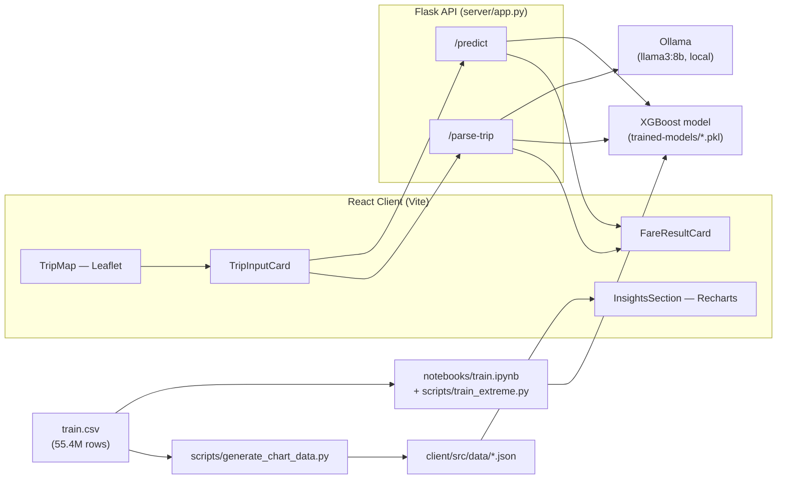

# NYC Taxi Fare Prediction

An end-to-end machine learning case study: predicting New York City taxi fares from pickup/drop-off
coordinates, time, and passenger count — served through a Flask API and a React client that lets you
place pins on a map, or just describe a trip in plain English and have a local LLM fill in the form.

Built against Kaggle's [New York City Taxi Fare Prediction](https://www.kaggle.com/competitions/new-york-city-taxi-fare-prediction)
competition (55.4M labeled trips), as the case-study project for RTB C16 — AI & ML (see
[`docs/RTB-C16-AI-ML.md`](docs/RTB-C16-AI-ML.md)).

---

## What's in here

| Ask a fare by pin-dropping on a map      | Or just describe the trip                                                    | Browse what the model learned                                                                     |
| ---------------------------------------- | ---------------------------------------------------------------------------- | ------------------------------------------------------------------------------------------------- |
| Click pickup, click drop-off, get a fare | "2 people from Times Square to JFK Friday at 6pm" → form + fare, in one step | Demand, fares, locations, and model-performance charts, all generated from the real training data |

- **Map-first trip input** — Leaflet map with draggable pickup/drop-off pins, live distance readout,
  reverse-geocoded address labels, and a handful of one-click NYC landmark shortcuts.
- **Natural-language trip parsing** — a local Ollama LLM extracts pickup/drop-off/time/passenger
  fields from free text; the server resolves those to coordinates and runs the fare model in the same
  request, so describing a trip can go straight to a predicted fare.
- **An XGBoost regression model** (26 engineered features, log-target, trained on up to 20M cleaned
  rows) served behind a small Flask API.
- **An insights dashboard** — demand patterns, fare distributions, top drop-off zones, and model
  comparison charts, all generated by a script that reads the same training data through the same
  cleaning/feature pipeline the model uses.
- **Light / dark / system theme**, fully token-driven.

---

## Architecture



**Two prediction paths, one model.** `/predict` and `/parse-trip` both call the same
`run_model_prediction()` function in `server/app.py`, so a fare computed from a manually-placed pin
and a fare computed from a parsed sentence are never silently different.

---

## Repo structure

```
├── client/                  React + TypeScript + Tailwind frontend (Vite)
│   ├── src/components/      TripMap, TripInputCard, FareResultCard, InsightsSection, ...
│   ├── src/data/            Generated chart JSON (see scripts/generate_chart_data.py)
│   ├── src/utils/           Validation, geocoding, landmark lookup, feature math
│   └── src/hooks/           useFarePrediction — the /predict call + loading/error/result state
├── server/                  Flask API
│   ├── app.py               /predict, /parse-trip
│   └── services.py          Ollama call + JSON extraction for /parse-trip
├── scripts/
│   ├── config.py            Every path, threshold, and constant used across scripts + server
│   ├── shared/
│   │   ├── data_utils.py    process_chunk() — the one cleaning pipeline everything shares
│   │   ├── features.py      compute_features() — the 26-feature engineering pass
│   │   └── landmarks.py     Landmark-name → coordinates lookup (used by /parse-trip)
│   ├── train_standard.py    In-memory training on a fixed row cap
│   ├── train_incremental.py Out-of-core training across the full 55.4M rows, chunk by chunk
│   ├── train_extreme.py     Single large sample, log-target XGBoost, GPU, early stopping
│   ├── generate_chart_data.py   Produces client/src/data/*.json from the real training data
│   └── evaluate_api.py      Holdout MAE check + Kaggle submission.csv generator, against the live API
├── notebooks/
│   ├── train.ipynb          The original EDA + model-comparison notebook
│   ├── test.ipynb / sanity.ipynb
├── trained-models/          Saved model + metadata .pkl files (see ⚠️ Known Issues below)
└── docs/                    PRDs, case-study plan, and this project's process history
```

---

## Getting started

### Prerequisites

- Node.js 18+ and npm
- Python 3.10+
- [Ollama](https://ollama.com), running locally, with a model pulled (default: `llama3:8b`)
- The Kaggle [`train.csv`](https://www.kaggle.com/competitions/new-york-city-taxi-fare-prediction/data)
  (55.4M rows, ~5.5 GB) if you intend to retrain or regenerate chart data — **not** required just to
  run the client/server against an already-trained model.

### 1. Server

```bash
cd server
pip install -r requirements.txt

# Pull the LLM used by /parse-trip (one-time)
ollama pull llama3:8b

python app.py
# Flask now listens on http://0.0.0.0:5000
```

> ⚠️ **Before running this**, read [Known Issues #1](#known-issues) below — in the current state of
> the repo, `server/app.py` will fail to start with a `FileNotFoundError`. It's a one-line config fix
> or a training run away; see the linked PRD for the exact options.

### 2. Client

```bash
cd client
npm install
npm run dev
# Vite dev server, default http://localhost:5173
```

The client expects the API at `http://localhost:5000` (see `client/src/api/fareApi.ts`).

### 3. (Optional) Regenerate the insights dashboard's data

```bash
# from the repo root, with train.csv in place per scripts/config.py's DATA_PATH
python -m scripts.generate_chart_data
```

Writes fresh JSON into `client/src/data/`. This reads a multi-million-row sample of `train.csv`
through the exact same `process_chunk` pipeline the training scripts use — chart numbers and model
numbers are never computed on two different versions of "clean" data.

### 4. (Optional) Retrain the model

```bash
cd scripts
python train_extreme.py       # single-pass, log-target XGBoost, ~20M row sample, GPU
# or
python train_incremental.py   # out-of-core, all 55.4M rows, chunk by chunk
# or
python train_standard.py      # simplest — in-memory, fixed row cap
```

Each writes a model `.pkl` and a metadata `.pkl` to `trained-models/`, at the paths named in
`scripts/config.py`.

---

## API reference

### `POST /predict`

Accepts a single trip object or a list of them.

```jsonc
// Request
{
  "pickup_lat": 40.758,
  "pickup_lon": -73.9855,
  "dropoff_lat": 40.6413,
  "dropoff_lon": -73.7781,
  "hour": 18,
  "day_of_week_num": 4,
  "month": 9,
  "year": 2026,
  "passenger_count": 2,
}
```

```jsonc
// Response
{ "fare_amount": 54.9, "distance_km": 25.58 }
```

Note the request takes **decomposed time fields** (`hour`, `day_of_week_num`, `month`, `year`), not a
datetime string — the client's `utils/dateTimeUtils.ts` does that decomposition before calling this
endpoint.

### `POST /parse-trip`

```jsonc
// Request
{ "description": "2 people from Times Square to JFK on Friday at 6pm" }
```

```jsonc
// Response — both landmarks resolved, fare included
{
  "pickup_landmark": "times square",
  "dropoff_landmark": "jfk airport",
  "hour": 18,
  "day_of_week_num": 4,
  "month": 9,
  "year": 2026,
  "passenger_count": 2,
  "pickup_resolved": true,
  "dropoff_resolved": true,
  "pickup_lat": 40.758,
  "pickup_lon": -73.9855,
  "dropoff_lat": 40.6413,
  "dropoff_lon": -73.7781,
  "fare_amount": 54.9,
  "distance_km": 25.58,
}
```

```jsonc
// Response — one landmark not recognized: still 200, no fare, a warning instead
{
  "pickup_landmark": "my apartment",
  "dropoff_landmark": "jfk airport",
  "hour": 18,
  "day_of_week_num": 4,
  "month": 9,
  "year": 2026,
  "passenger_count": 1,
  "pickup_resolved": false,
  "dropoff_resolved": true,
  "dropoff_lat": 40.6413,
  "dropoff_lon": -73.7781,
  "warning": "Couldn't recognize the pickup location in that description. Place the pin on the map to get a fare estimate.",
}
```

The LLM only ever extracts landmark **names** — `scripts/shared/landmarks.py` (server) and
`client/src/utils/landmarks.ts` (client fallback) are the two places that know real coordinates.
Widening trip-description coverage means adding entries there, not touching the LLM prompt.

---

## The model

- **Algorithm:** XGBoost regression (`xgb.XGBRegressor`), trained on the **log** of `fare_amount`
  (`np.log1p`), predictions inverted with `np.expm1` at inference time — see
  `server/app.py::run_model_prediction`.
- **26 features** — raw coordinates, passenger count, decomposed time fields, straight-line and
  Manhattan-grid distance, distance to JFK/LGA/EWR from both pickup and drop-off, a rush-hour flag, an
  overnight flag, trip bearing, a flag for NYC's actual September 2012 fare-structure change, and a
  flag approximating JFK-to-Manhattan flat-rate trips. Full list and derivations:
  `scripts/shared/features.py`.
- **Data cleaning** (`scripts/shared/data_utils.py::process_chunk`): fares $2.50–$300, 1–6
  passengers, both points inside a fixed NYC lat/lon box, trip distance 0.1–85 km.
- **Reported validation RMSE:** ~$3.55 (`trained-models/model_metadata.pkl`) — against Kaggle's own
  stated "$5–8 with distance alone" reference point for this competition.
- **Model comparison** (hardcoded-mean baseline → distance-only linear regression → 5-feature linear
  regression → random forest → the production XGBoost model) is computed fresh, on the same cleaned
  sample, every time `scripts/generate_chart_data.py::model_comparison()` runs — see the Insights tab
  in the client, or `client/src/data/model_comparison.json`.

For the full reasoning behind these choices — including sample viva-style Q&A — see
[`docs/Phase1_Viva_Prep_Guide.md`](docs/Phase1_Viva_Prep_Guide.md).

---

## ⚠️ Known Issues

A full review (build/lint output, a manual code read-through, and checking every model path
`server/app.py` and `scripts/generate_chart_data.py` reference against what's actually committed in
`trained-models/`) turned up one blocking issue and several smaller ones. Full detail, evidence, and
proposed fixes: [`docs/Taxi_Fare_UI_PRD_v5_Fixes_and_Enhancements.md`](docs/Taxi_Fare_UI_PRD_v5_Fixes_and_Enhancements.md).

1. **The server won't start.** `server/app.py` and `scripts/generate_chart_data.py` both load
   `trained-models/fare_model_extreme.pkl` / `model_metadata_extreme.pkl` — neither file exists in
   the repo. `train_extreme.py` appears to have never actually been run (or its output was never
   committed). This is a `FileNotFoundError` at import time, not a runtime edge case — read the PRD
   before trying to run the server.
2. A handful of UI/UX and consistency issues (a dark-theme map using a light basemap style, a
   committed-in-plaintext API key, a color mismatch between the map's pin icons and its floating
   controls, and no keyboard/screen-reader-accessible way to set a location now that manual lat/lon
   fields have been replaced by map-only pin placement) — see the same PRD for all of them, prioritized.

---

## Documentation index

| Doc                                                                                                            | What it's for                                                                          |
| -------------------------------------------------------------------------------------------------------------- | -------------------------------------------------------------------------------------- |
| [`docs/RTB-C16-AI-ML.md`](docs/RTB-C16-AI-ML.md)                                                               | The original case-study brief this project answers                                     |
| [`docs/NYC_Taxi_Fare_CaseStudy_Plan.md`](docs/NYC_Taxi_Fare_CaseStudy_Plan.md)                                 | Early planning notes for the case study                                                |
| [`docs/Phase1_Viva_Prep_Guide.md`](docs/Phase1_Viva_Prep_Guide.md)                                             | Milestone-by-milestone viva prep: concepts, this repo's actual code, sample Q&A        |
| [`docs/Phase2_CaseStudy_Demo_Guide.md`](docs/Phase2_CaseStudy_Demo_Guide.md)                                   | Demo script + anticipated evaluator questions for the live showcase                    |
| [`docs/Taxi_Fare_UI_PRD_v4_ReferenceMockupAlignment.md`](docs/Taxi_Fare_UI_PRD_v4_ReferenceMockupAlignment.md) | The PRD that took the client from a single stacked form to the current map-hero layout |
| [`docs/Taxi_Fare_UI_PRD_v5_Fixes_and_Enhancements.md`](docs/Taxi_Fare_UI_PRD_v5_Fixes_and_Enhancements.md)     | Post-implementation review: bugs found, prioritized, with fix plans                    |

Older PRDs (`v1`–`v3`) are kept for history; `v4` describes the design the client was actually built
against and is the one worth reading if you want to understand _why_ a component looks the way it does.

---

## Credits

Dataset and problem statement: Kaggle's
[New York City Taxi Fare Prediction](https://www.kaggle.com/competitions/new-york-city-taxi-fare-prediction)
competition. Built as a case-study project for RTB C16 — AI & ML.
